# cambridgema 

<!-- badges: start -->
[](https://github.com/xiaolong-y/cambridgema/actions/workflows/R-CMD-check.yaml)
[](https://app.codecov.io/gh/xiaolong-y/cambridgema?branch=main)
[](https://opensource.org/licenses/MIT)
<!-- badges: end -->

**Nature-inspired color palettes for data visualization**

Beautiful color palettes inspired by Cambridge, Massachusetts. From the cherry blossoms of Fresh Pond to the frozen Charles River, these palettes capture Cambridge, MA's natural beauty across all four seasons.

## Quick Start

```r
library(cambridgema)
library(ggplot2)

# Use with ggplot2
ggplot(iris, aes(Sepal.Width, Sepal.Length, color = Species)) +
  geom_point(size = 3) +
  scale_color_cam("autumn") +
  theme_minimal()
```

## Installation

```r
# Install from GitHub
# install.packages("remotes")
remotes::install_github("xiaolong-y/cambridgema")
```

## Palettes at a Glance

```r
# View all palettes
plot_cam_demo()
```

<p align="center">
  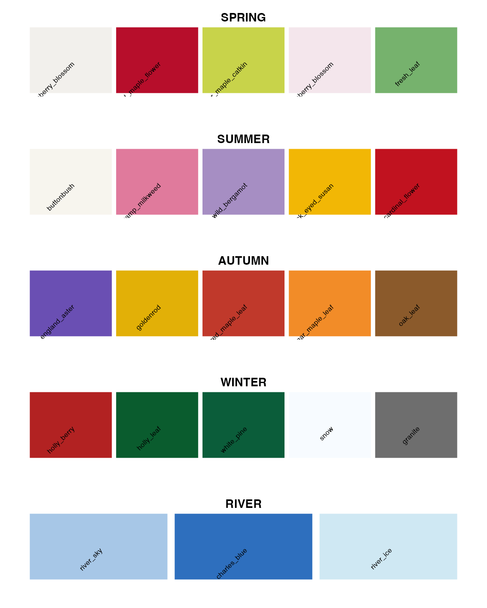
</p>

### Individual Palette Cards

<p align="center">
  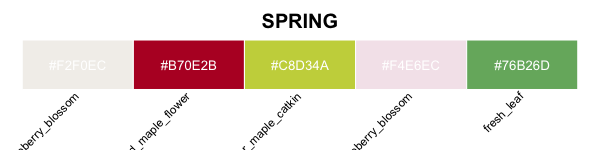
  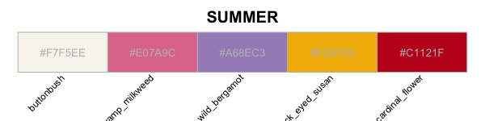
</p>
<p align="center">
  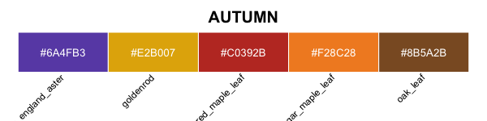
  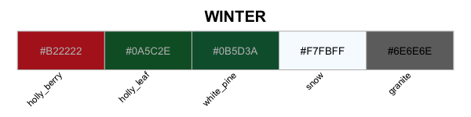
</p>
<p align="center">
  
</p>

### Palette Types

| Type | Palettes | Use Case |
|------|----------|----------|
| **Categorical** | `spring`, `summer`, `autumn`, `winter`, `river` | Discrete groups (5 colors each) |
| **Sequential** | `crimson_seq`, `river_seq`, `foliage_seq` | Continuous data (7 colors each) |
| **Diverging** | `crimson_blue`, `brick_pine` | Centered data like correlations (9 colors) |

### Seasonal Palettes

- **`spring`** - Cherry blossoms, maple flowers, and fresh leaves from Fresh Pond
- **`summer`** - Cardinal flowers, milkweed, and bergamot from Cambridge Common
- **`autumn`** - Asters, goldenrod, and maple leaves from Harvard Yard
- **`winter`** - Holly, pine, snow, and granite from the Charles River Esplanade
- **`river`** - Charles River blues through the seasons

## Default vs cambridgema Comparison

<p align="center">
  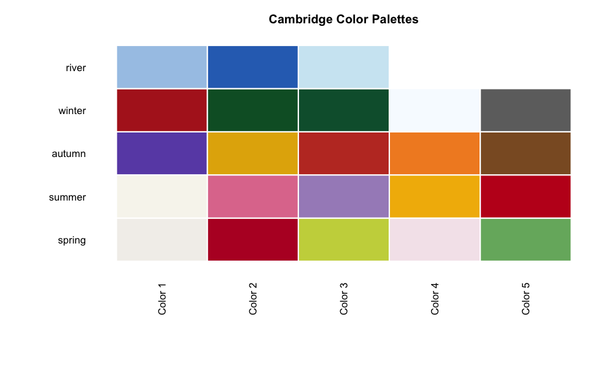
</p>

## Accessibility Tools

Check color distinguishability for any palette:

```r
check_colorblind("autumn")
```

Visualize how a palette appears under different viewing conditions:

```r
plot_colorblind_sim("autumn")
```

## Usage Examples

### Categorical Data (Discrete Scales)

```r
# Bar chart with summer palette
ggplot(mpg, aes(class, fill = class)) +
  geom_bar() +
  scale_fill_cam("summer") +
  theme_minimal()
```

### Continuous Data (Sequential Scales)

```r
# Heatmap with sequential palette
ggplot(faithfuld, aes(waiting, eruptions, fill = density)) +
  geom_tile() +
  scale_fill_cam("river_seq", discrete = FALSE) +
  theme_minimal()
```

<p align="center">
  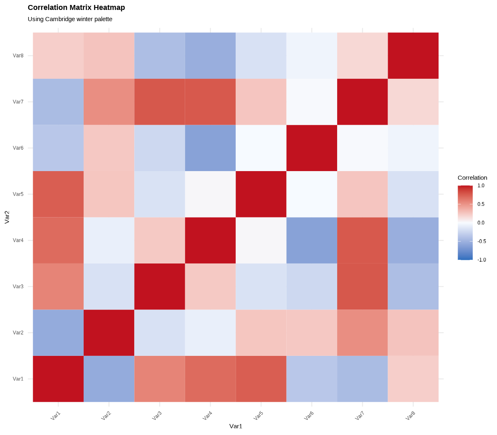
</p>

### Centered Data (Diverging Scales)

Diverging palettes automatically center on zero - perfect for correlations:

```r
# Correlation matrix
cor_data <- data.frame(
  x = rep(1:5, 5), y = rep(1:5, each = 5),
  r = c(cor(mtcars[, 1:5]))
)

ggplot(cor_data, aes(x, y, fill = r)) +
  geom_tile() +
  scale_fill_cam("crimson_blue") +  # Auto-centers on 0
  labs(title = "Correlation Matrix") +
  theme_minimal()
```

### Base R Usage

```r
# Access individual colors
cam_colors["maple_red"]
#> maple_red
#>  "#B70E2B"

# Get n colors from a palette
cam_cols(5, "autumn")

# Barplot with autumn colors
barplot(c(3, 7, 9, 6, 2),
        col = cam_cols(5, "autumn"),
        main = "Autumn in Cambridge")
```

### Handling Missing Values

Missing data uses neutral `granite_gray` by default:

```r
df <- data.frame(x = 1:4, y = c(2, NA, 3, 4), g = c("A", "B", "C", "D"))

ggplot(df, aes(x, y, color = g)) +
  geom_point(size = 5) +
  scale_color_cam("spring", na.value = cam_colors["snow_white"]) +
  theme_minimal()
```

## Statistical Analysis Examples

The package includes colors optimized for common statistical visualizations:

### Visualization Gallery

<p align="center">
  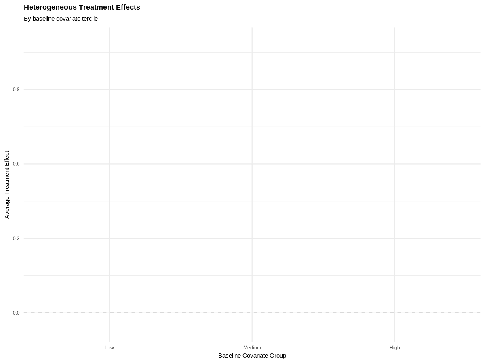
  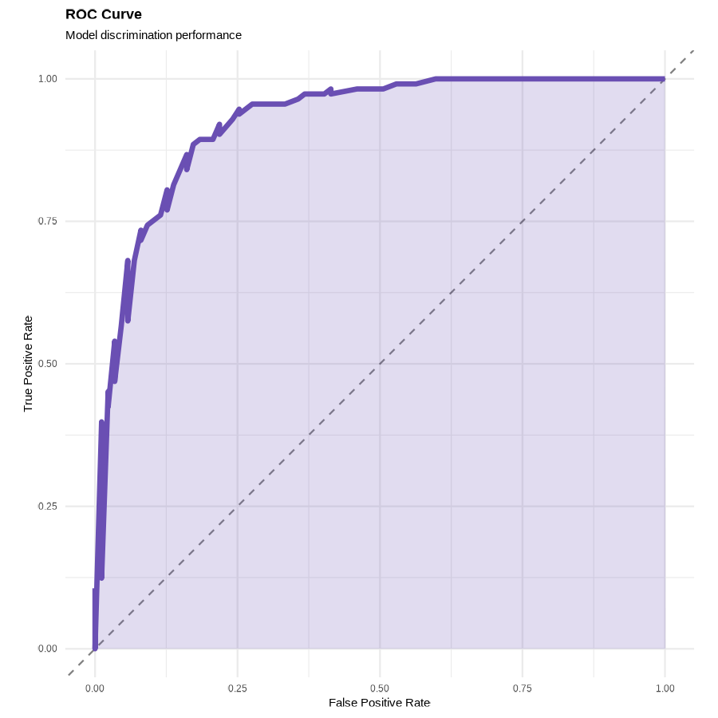
</p>

<p align="center">
  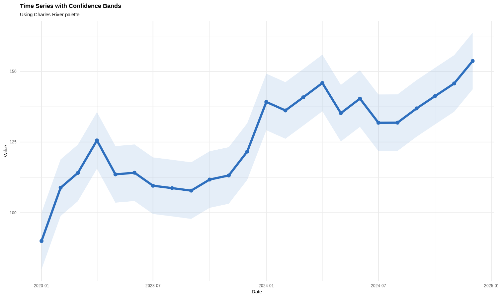
</p>

<p align="center">
  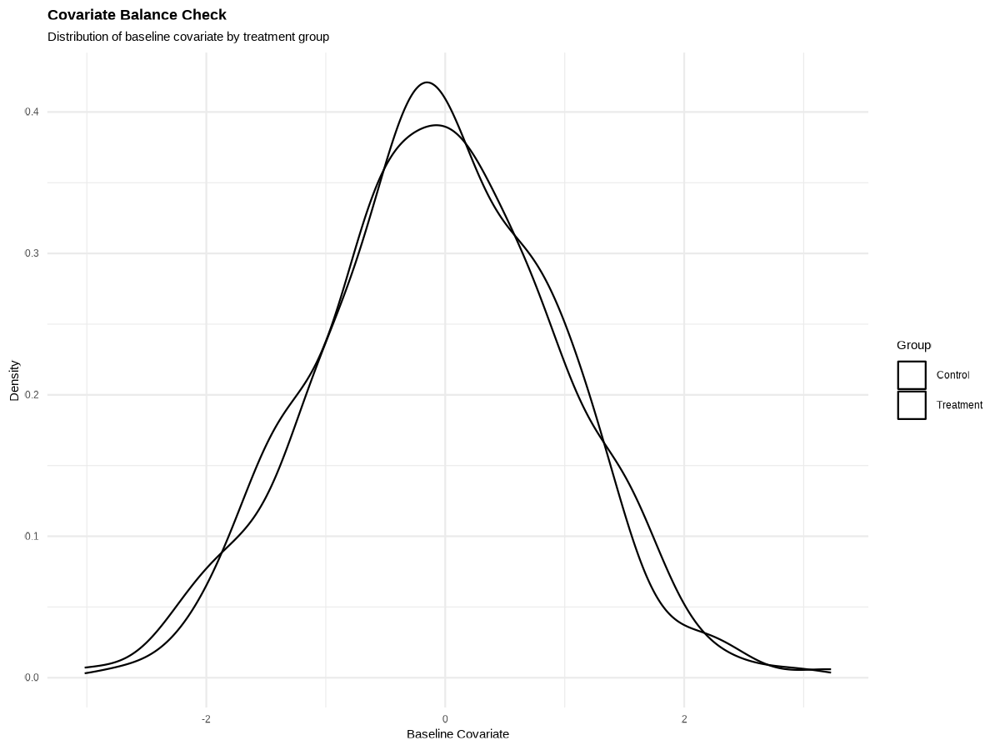
  
</p>

<p align="center">
  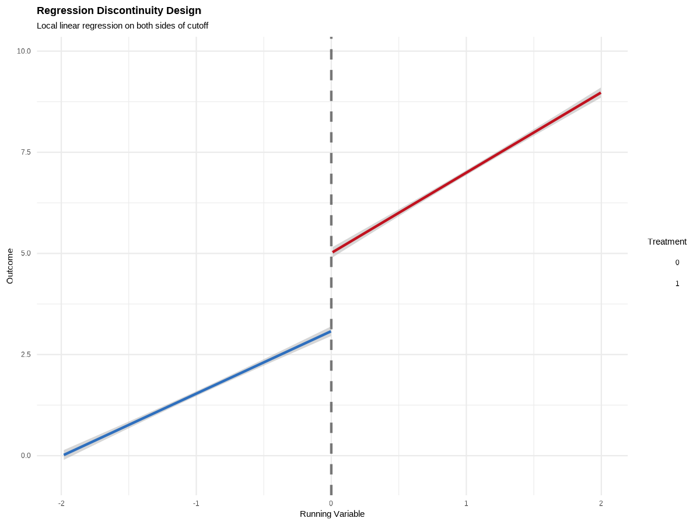
  
</p>

### Example Code

**Forest Plot (Treatment Effects)**
```r
ggplot(effects, aes(x = subgroup, y = effect, color = subgroup)) +
  geom_hline(yintercept = 0, linetype = "dashed", alpha = 0.5) +
  geom_point(size = 4) +
  geom_errorbar(aes(ymin = ci_lower, ymax = ci_upper), width = 0.2) +
  scale_color_cam("autumn") +
  coord_flip() +
  theme_minimal()
```

**Time Series with Confidence Bands**
```r
ggplot(df_ts, aes(x = date)) +
  geom_ribbon(aes(ymin = lower, ymax = upper),
              fill = cam_colors["river_sky"], alpha = 0.3) +
  geom_line(aes(y = value), color = cam_colors["charles_blue"], linewidth = 1.5) +
  theme_minimal()
```

**ROC Curve**
```r
ggplot(roc_data, aes(x = fpr, y = tpr)) +
  geom_abline(linetype = "dashed", alpha = 0.5) +
  geom_area(fill = cam_colors["aster_purple"], alpha = 0.2) +
  geom_line(color = cam_colors["aster_purple"], linewidth = 1.5) +
  coord_equal() +
  theme_minimal()
```

## Color Reference

### List All Palettes

```r
list_palettes()
#> $categorical
#> [1] "spring" "summer" "autumn" "winter" "river"
#>
#> $sequential
#> [1] "crimson_seq" "river_seq" "foliage_seq"
#>
#> $diverging
#> [1] "crimson_blue" "brick_pine"
```

### View Palette Details

```r
print_palette("spring")
#> Palette: spring
#> Colors: 5
#> Type: categorical
#>
#>    1. spring_blossom      #E8B4BC
#>    2. maple_red           #B70E2B
#>    3. catkin_green        #9AB54A
#>    4. fresh_leaf          #3A7D44
#>    5. spring_sky          #6CA6CD
```

### Palette Summary

| Palette | Type | Colors | Best For |
|---------|------|--------|----------|
| `spring` | Categorical | 5 | Cherry blossoms, fresh growth |
| `summer` | Categorical | 5 | Bright wildflowers |
| `autumn` | Categorical | 5 | Warm fall foliage |
| `winter` | Categorical | 5 | Cool, muted tones |
| `river` | Categorical | 5 | Water/sky themes |
| `crimson_seq` | Sequential | 7 | Light to dark red |
| `river_seq` | Sequential | 7 | Light to dark blue |
| `foliage_seq` | Sequential | 7 | Warm gradient (yellow to rust) |
| `crimson_blue` | Diverging | 9 | Correlations, differences |
| `brick_pine` | Diverging | 9 | CVD-safe red/green alternative |

## Advanced Usage

### Custom Interpolation

```r
# Get 10 interpolated colors from a 5-color palette
cam_pal("autumn")(10)

# Reverse any palette
cam_palette("spring", reverse = TRUE)
```

### Combining with patchwork

```r
library(patchwork)

p1 <- ggplot(df, aes(x, y, color = group)) +
  geom_point() +
  scale_color_cam("spring")

p2 <- ggplot(df, aes(x, fill = group)) +
  geom_histogram() +
  scale_fill_cam("autumn")

p1 + p2 + plot_layout(guides = "collect")
```

## API Reference

| Function | Description |
|----------|-------------|
| `cam_colors` | Named vector of all 50+ colors |
| `cam_palette(name)` | Get colors for a specific palette |
| `cam_pal(name)` | Get a palette function for interpolation |
| `cam_cols(n, name)` | Get exactly n colors from a palette |
| `scale_color_cam()` | ggplot2 color scale |
| `scale_fill_cam()` | ggplot2 fill scale |
| `list_palettes()` | List all available palettes by type |
| `print_palette(name)` | Print palette details |
| `check_colorblind(name)` | Check colorblind accessibility |
| `plot_colorblind_sim(name)` | Visualize CVD simulation |
| `plot_cam_demo()` | Display all palettes |

## Contributing

Contributions welcome! Please submit issues or PRs on [GitHub](https://github.com/xiaolong-y/cambridgema).

## Acknowledgments

Palettes inspired by the flora of Cambridge, MA:
- Fresh Pond Reservation
- Cambridge Common
- Charles River Esplanade
- Harvard Yard
- Alewife Brook Reservation

## License

MIT

---

*Created in Cambridge, MA*
