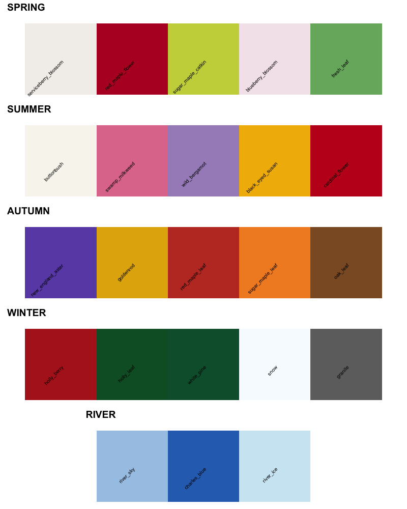
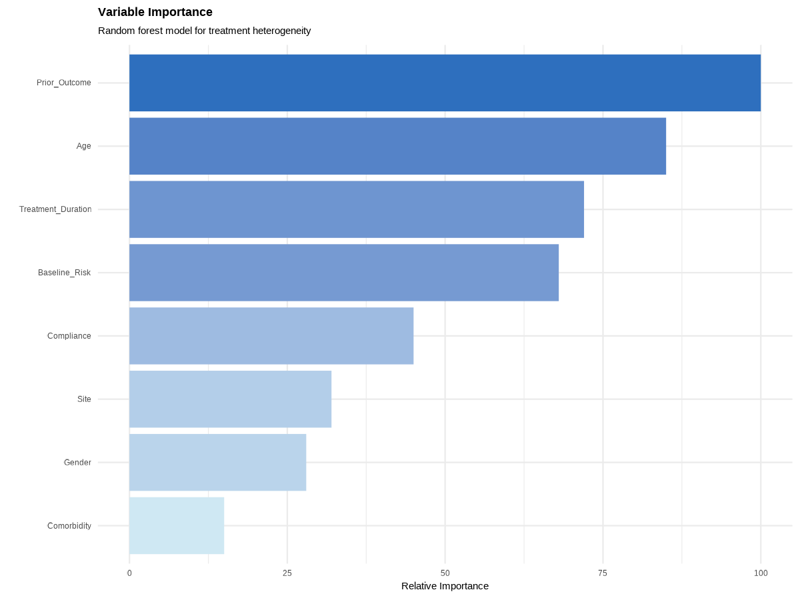

# cantabcolors 

<!-- badges: start -->
[](https://github.com/YOUR_GITHUB_USERNAME/cantabcolors/actions)
[](https://opensource.org/licenses/MIT)
<!-- badges: end -->

**Cambridge, MA inspired color palettes for R** 

Beautiful, natural color palettes inspired by the flora and seasons of Cambridge, Massachusetts. From the serviceberry blossoms of Fresh Pond in spring to the frozen Charles River in winter, these palettes capture the essence of Cambridge's natural beauty for your data visualizations.

## Installation

```r
# Install from GitHub
# install.packages("remotes")
remotes::install_github("xiaolong-y/cantabcolors")
```

## Palettes

All palettes are colorblind-friendly and designed for both discrete and continuous scales.

```r
library(cantabcolors)

# View all available palettes
plot_cam_demo()
```



### Available Palettes

- **`spring`** - Serviceberry blossoms, red maple flowers, and fresh leaves from Cambridge Common
- **`summer`** - Buttonbush, swamp milkweed, and cardinal flowers from Fresh Pond
- **`autumn`** - New England asters, goldenrod, and maple leaves throughout the city
- **`winter`** - Holly, white pine, snow, and granite from Harvard Yard
- **`river`** - Charles River blues and sky reflections

## Usage

### Basic Usage with Base R

```r
# Access individual colors
cam_colors["red_maple_flower"]
#> red_maple_flower 
#>       "#B70E2B"

# Get n colors from a palette
cam_cols(5, "autumn")

# Simple bar plot
barplot(c(3, 7, 9, 6, 2), 
        col = cam_cols(5, "autumn"),
        main = "Autumn in Cambridge")
```

### ggplot2 Integration

The package provides color and fill scales for seamless ggplot2 integration:

```r
library(ggplot2)
library(cantabcolors)

# Discrete scales
ggplot(iris, aes(Sepal.Width, Sepal.Length, color = Species)) +
  geom_point(size = 3) +
  scale_color_cam("spring") +
  theme_minimal()

# Continuous scales  
ggplot(faithfuld, aes(waiting, eruptions, fill = density)) +
  geom_tile() +
  scale_fill_cam("river", discrete = FALSE) +
  theme_minimal()
```

### Handling Missing Values

Missing data are displayed using the neutral `granite` tone by default. Use
`na.value` to customize this colour.

```r
df_missing <- data.frame(
  x = 1:4,
  y = c(2, NA, 3, 4),
  g = c("A", "B", "C", "D")
)

ggplot(df_missing, aes(x, y, color = g)) +
  geom_point(size = 3) +
  scale_color_cam("spring", na.value = cam_colors["snow"]) +
  theme_minimal()
```

## Examples for Statistical Analysis

### Causal Inference and Treatment Effects

#### Randomized Controlled Trial Analysis

```r
# Heterogeneous treatment effects (forest plot)
library(ggplot2)
library(dplyr)

# Simulate RCT data
set.seed(42)
n <- 500
treatment <- rbinom(n, 1, 0.5)
baseline <- rnorm(n)
outcome <- 2 + 0.5*treatment + 0.3*baseline + rnorm(n)
heterogeneity <- cut(baseline, breaks = 3, labels = c("Low", "Medium", "High"))

df_rct <- data.frame(
  treatment = factor(treatment, labels = c("Control", "Treatment")),
  outcome = outcome,
  heterogeneity = heterogeneity
)

# Calculate subgroup effects
effects <- df_rct %>%
  group_by(heterogeneity) %>%
  summarise(
    effect = mean(outcome[treatment == "Treatment"]) - 
             mean(outcome[treatment == "Control"]),
    se = sqrt(var(outcome[treatment == "Treatment"])/sum(treatment == "Treatment") + 
              var(outcome[treatment == "Control"])/sum(treatment == "Control")),
    ci_lower = effect - 1.96*se,
    ci_upper = effect + 1.96*se
  )

# Forest plot
ggplot(effects, aes(x = heterogeneity, y = effect, color = heterogeneity)) +
  geom_hline(yintercept = 0, linetype = "dashed", alpha = 0.5) +
  geom_point(size = 4) +
  geom_errorbar(aes(ymin = ci_lower, ymax = ci_upper), width = 0.2, size = 1) +
  scale_color_cam("autumn") +
  labs(title = "Heterogeneous Treatment Effects",
       x = "Baseline Covariate Group",
       y = "Average Treatment Effect") +
  theme_minimal() +
  theme(legend.position = "none")
```


#### Covariate Balance Check

```r
# Check covariate balance between treatment groups
ggplot(df_rct, aes(x = baseline, fill = treatment)) +
  geom_density(alpha = 0.7) +
  scale_fill_cam("spring") +
  labs(title = "Covariate Balance Check",
       x = "Baseline Covariate",
       y = "Density") +
  theme_minimal()
```


#### Regression Discontinuity Design

```r
# Simulate RD data
running_var <- runif(500, -2, 2)
treatment_rd <- as.numeric(running_var > 0)
outcome_rd <- 3 + 2*treatment_rd + 1.5*running_var + 
              0.5*treatment_rd*running_var + rnorm(500, 0, 0.5)

df_rd <- data.frame(
  running = running_var, 
  outcome = outcome_rd,
  treated = factor(treatment_rd)
)

# RD plot
ggplot(df_rd, aes(x = running, y = outcome)) +
  geom_vline(xintercept = 0, linetype = "dashed", alpha = 0.5) +
  geom_point(aes(color = treated), alpha = 0.3) +
  geom_smooth(data = filter(df_rd, running < 0), 
              method = "lm", se = TRUE, color = cam_colors["charles_blue"]) +
  geom_smooth(data = filter(df_rd, running >= 0), 
              method = "lm", se = TRUE, color = cam_colors["cardinal_flower"]) +
  scale_color_cam("summer") +
  labs(title = "Regression Discontinuity Design",
       x = "Running Variable",
       y = "Outcome") +
  theme_minimal()
```


#### Difference-in-Differences

```r
# Simulate DiD data
periods <- 6
time_data <- expand.grid(
  period = 1:periods,
  group = c("Control", "Treatment")
)
time_data$outcome <- with(time_data, 
  10 + 0.5*period + 2*(group == "Treatment") + 
  3*(group == "Treatment" & period > 3) + rnorm(nrow(time_data), 0, 0.5)
)

# DiD plot
ggplot(time_data, aes(x = period, y = outcome, color = group)) +
  geom_vline(xintercept = 3.5, linetype = "dashed", alpha = 0.5) +
  geom_line(size = 1.5) +
  geom_point(size = 3) +
  scale_color_cam("winter") +
  labs(title = "Difference-in-Differences",
       x = "Time Period",
       y = "Outcome") +
  theme_minimal()
```


### Machine Learning & Prediction

#### ROC Curves

```r
# ROC curve with autumn palette
ggplot(roc_data, aes(x = fpr, y = tpr)) +
  geom_abline(intercept = 0, slope = 1, linetype = "dashed", alpha = 0.5) +
  geom_line(color = cam_colors["new_england_aster"], size = 1.5) +
  geom_area(alpha = 0.2, fill = cam_colors["new_england_aster"]) +
  labs(title = "ROC Curve",
       x = "False Positive Rate",
       y = "True Positive Rate") +
  theme_minimal() +
  coord_equal()
```


#### Variable Importance

```r
# Variable importance from random forest
ggplot(var_imp, aes(x = variable, y = importance, fill = importance)) +
  geom_col() +
  scale_fill_gradient(low = cam_colors["river_ice"], 
                      high = cam_colors["charles_blue"]) +
  coord_flip() +
  labs(title = "Variable Importance",
       x = "", y = "Relative Importance") +
  theme_minimal()
```



### Publication-Ready Multi-Panel Figures

```r
library(gridExtra)

# Create multiple panels for a publication
p1 <- ggplot(df_balance, aes(x = covariate, fill = group)) +
  geom_histogram(alpha = 0.7, position = "identity") +
  scale_fill_cam("spring") +
  labs(title = "A. Randomization Check") +
  theme_minimal()

p2 <- ggplot(df_effects, aes(x = effect)) +
  geom_histogram(fill = cam_colors["cardinal_flower"], alpha = 0.8) +
  labs(title = "B. Treatment Effect Distribution") +
  theme_minimal()

p3 <- ggplot(df_dose, aes(x = dose, y = response)) +
  geom_point(color = cam_colors["goldenrod"]) +
  geom_smooth(color = cam_colors["charles_blue"]) +
  labs(title = "C. Dose-Response Curve") +
  theme_minimal()

p4 <- ggplot(df_subgroup, aes(x = effect, y = subgroup)) +
  geom_errorbarh(aes(xmin = ci_lower, xmax = ci_upper)) +
  geom_point(color = cam_colors["red_maple_leaf"]) +
  labs(title = "D. Subgroup Analysis") +
  theme_minimal()

grid.arrange(p1, p2, p3, p4, ncol = 2)
```


### Heatmaps and Correlation Matrices

```r
# Correlation heatmap with winter palette
ggplot(cor_long, aes(x = Var1, y = Var2, fill = value)) +
  geom_tile() +
  scale_fill_gradient2(
    low = cam_colors["charles_blue"],
    mid = cam_colors["snow"],
    high = cam_colors["cardinal_flower"],
    midpoint = 0
  ) +
  labs(title = "Correlation Matrix") +
  theme_minimal()
```


### Time Series Analysis

```r
# Time series with confidence bands
ggplot(df_ts, aes(x = date)) +
  geom_ribbon(aes(ymin = ci_lower, ymax = ci_upper), 
              fill = cam_colors["river_sky"], alpha = 0.3) +
  geom_line(aes(y = value), color = cam_colors["charles_blue"], size = 1.5) +
  labs(title = "Time Series with Confidence Bands") +
  theme_minimal()
```


## Color Reference

### All Colors

```r
# View all individual colors
cam_colors

# Access specific colors
cam_colors[c("serviceberry_blossom", "charles_blue", "red_maple_leaf")]
```

### Palette Details

| Palette | Inspired By | Best For | Colors |
|---------|------------|----------|---------|
| `spring` | Fresh Pond in April-May | Categorical comparisons | 5 colors |
| `summer` | Cambridge Common in July | Bright contrasts | 5 colors |
| `autumn` | Harvard Yard in October | Warm gradients | 5 colors |
| `winter` | Charles River in January | Cool contrasts | 5 colors |
| `river` | Charles River year-round | Sequential data | 3 colors |

## Advanced Usage

### Custom Interpolation

```r
# Get exactly n colors from any palette
my_colors <- cam_pal("autumn")(10)  # 10 interpolated autumn colors

# Reverse any palette
cam_palette("spring", reverse = TRUE)
```

### Combining with Other Packages

```r
# Use with patchwork for complex layouts
library(patchwork)
p1 + p2 + plot_layout(guides = "collect") & 
  scale_color_cam("autumn")

# Use with gganimate for animated plots
library(gganimate)
ggplot(data, aes(x, y, color = group)) +
  geom_point() +
  scale_color_cam("river") +
  transition_states(time)
```

## Contributing

We welcome contributions! Please feel free to submit issues or pull requests on [GitHub](https://github.com/YOUR_GITHUB_USERNAME/cantabcolors).

## Acknowledgments

Color palettes are inspired by the native and commonly observed plant species throughout Cambridge, MA, including:
- Fresh Pond Reservation
- Cambridge Common
- Charles River Esplanade
- Harvard Yard
- Alewife Brook Reservation

## License

MIT © Xiaolong Yang

---

*Created 🍁 in LA Burdicks, Cambridge, MA*

