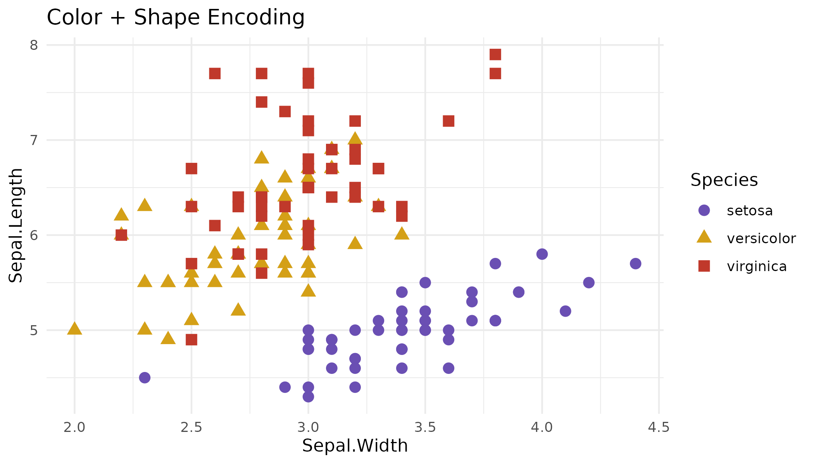
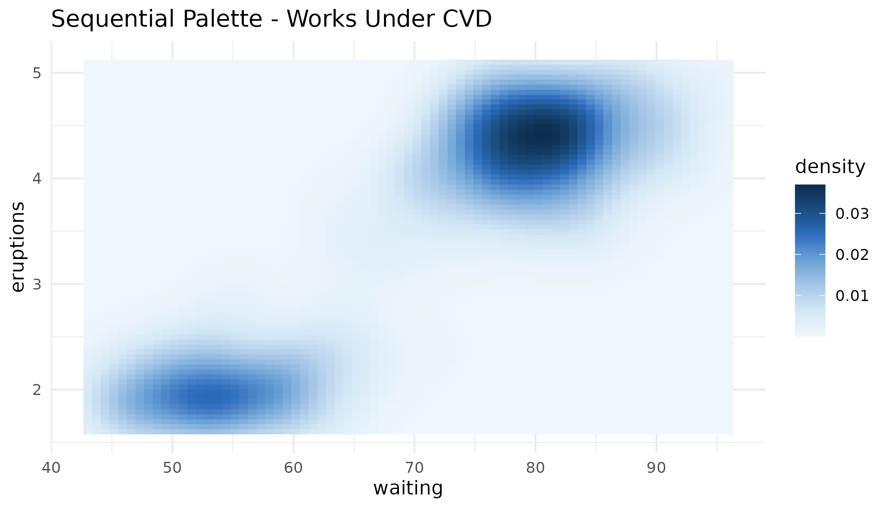
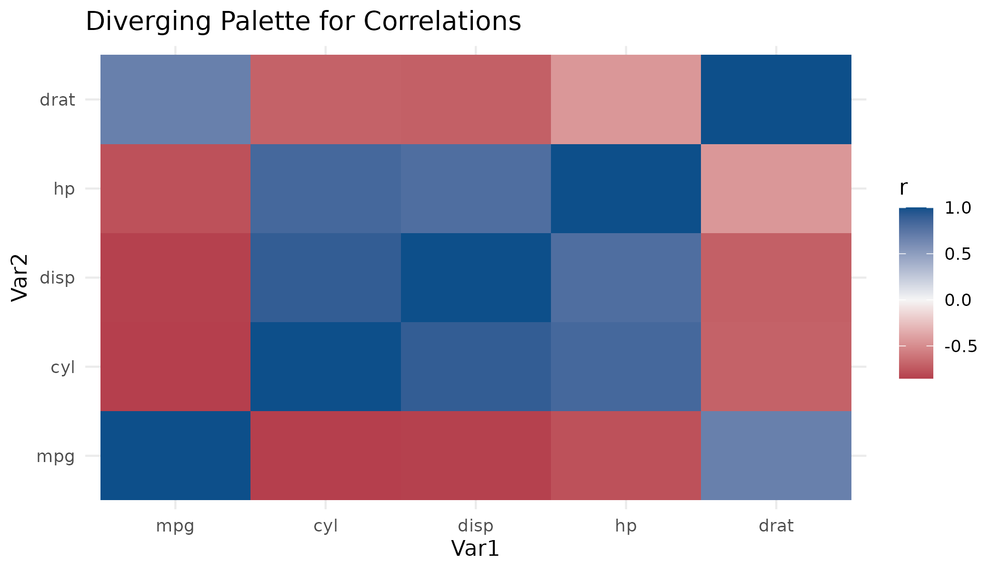

# Colorblind-Friendly Visualization

## Why Colorblind Accessibility Matters

Approximately 8% of males and 0.5% of females have some form of color
vision deficiency (CVD). The most common types are:

- **Deuteranopia** (~6% of males): Reduced sensitivity to green light
- **Protanopia** (~2% of males): Reduced sensitivity to red light
- **Tritanopia** (rare): Reduced sensitivity to blue light

Creating accessible visualizations ensures your data communicates
effectively to all audiences.

``` r
library(cambridgema)
library(ggplot2)
```

## Checking Palette Accessibility

Use
[`check_colorblind()`](https://xiaolong-y.github.io/cambridgema/reference/check_colorblind.md)
to verify any palette:

``` r
check_colorblind("autumn")
#> Colorblind Accessibility Check
#> ------------------------------
#> Status: PASS 
#> Threshold: 10 
#> 
#> Minimum color distances:
#>   Normal vision:   28.82 
#>   Deuteranopia:    9.87 (red-green, ~6% males)
#>   Protanopia:      7.34 (red, ~2% males)
#>   Tritanopia:      18.09 (blue-yellow, rare)
```

The function reports:

- **Normal vision distance**: How distinguishable colors are under
  normal vision
- **CVD distances**: Distinguishability under each type of color
  blindness
- **Pass/Fail**: Whether the palette meets accessibility thresholds

## Simulating Color Vision Deficiency

The
[`plot_colorblind_sim()`](https://xiaolong-y.github.io/cambridgema/reference/plot_colorblind_sim.md)
function shows how palettes appear under different types of CVD:

``` r
plot_colorblind_sim("autumn")
```


You can also simulate individual colors:

``` r
# Get autumn colors
autumn_cols <- cam_palette("autumn")
autumn_cols
#>  aster_purple     goldenrod maple_scarlet  maple_orange     oak_brown 
#>     "#6A4FB3"     "#D4A017"     "#C0392B"     "#E07020"     "#6B4423"

# Simulate deuteranopia
simulate_cvd(autumn_cols, "deuteranopia")
#>  aster_purple     goldenrod maple_scarlet  maple_orange     oak_brown 
#>     "#245FB1"     "#C2AE22"     "#827525"     "#AC991D"     "#595023"
```

## Design Principles

All cambridgema palettes are designed with these accessibility
principles:

### 1. Luminance Variation

Colors in each palette have distinct brightness levels, making them
distinguishable even in grayscale:

``` r
# The autumn palette has varied luminance
barplot(rep(1, 5), col = cam_palette("autumn"), border = NA,
        main = "Autumn Palette - Note Varying Brightness")
```


### 2. Avoiding Problematic Combinations

We avoid pure red-green pairs that are indistinguishable under
deuteranopia and protanopia. The `brick_pine` diverging palette
specifically addresses this:

``` r
# brick_pine is designed to be CVD-safe
check_colorblind("brick_pine")
#> Colorblind Accessibility Check
#> ------------------------------
#> Status: FAIL 
#> Threshold: 10 
#> 
#> Minimum color distances:
#>   Normal vision:   11.75 
#>   Deuteranopia:    1.7 (red-green, ~6% males)
#>   Protanopia:      9.08 (red, ~2% males)
#>   Tritanopia:      11.8 (blue-yellow, rare)
```

### 3. Sufficient Color Distance

Colors maintain a minimum CIE LAB distance of 10 units, ensuring they
remain distinguishable under CVD simulation.

## Best Practices

### Pair Color with Other Visual Encodings

Don’t rely on color alone. Combine with:

- **Shapes**: Use different point shapes for groups
- **Line types**: Use solid, dashed, dotted lines
- **Labels**: Add direct labels when possible

``` r
ggplot(iris, aes(Sepal.Width, Sepal.Length,
                 color = Species, shape = Species)) +
  geom_point(size = 3) +
  scale_color_cam("autumn") +
  labs(title = "Color + Shape Encoding") +
  theme_minimal()
```



### Use Sequential Palettes for Ordered Data

Sequential palettes like `river_seq` and `foliage_seq` use luminance
gradients that work well under CVD:

``` r
ggplot(faithfuld, aes(waiting, eruptions, fill = density)) +
  geom_tile() +
  scale_fill_cam("river_seq", discrete = FALSE) +
  labs(title = "Sequential Palette - Works Under CVD") +
  theme_minimal()
```



### Use Diverging Palettes for Centered Data

For data with a meaningful center point (like correlations), use
diverging palettes. The `crimson_blue` palette provides good contrast:

``` r
cor_mat <- cor(mtcars[, 1:5])
cor_df <- as.data.frame(as.table(cor_mat))
names(cor_df) <- c("Var1", "Var2", "r")

ggplot(cor_df, aes(Var1, Var2, fill = r)) +
  geom_tile() +
  scale_fill_cam("crimson_blue") +
  labs(title = "Diverging Palette for Correlations") +
  theme_minimal()
```



## Checking Your Own Colors

You can check any set of colors:

``` r
# Check custom colors
my_colors <- c("#1B9E77", "#D95F02", "#7570B3", "#E7298A")
check_colorblind(my_colors)
#> Colorblind Accessibility Check
#> ------------------------------
#> Status: PASS 
#> Threshold: 10 
#> 
#> Minimum color distances:
#>   Normal vision:   63.84 
#>   Deuteranopia:    5.88 (red-green, ~6% males)
#>   Protanopia:      15.03 (red, ~2% males)
#>   Tritanopia:      15.73 (blue-yellow, rare)
```

## Comparing Palettes

Check all cambridgema palettes:

``` r
# Check all categorical palettes
for (pal in list_palettes()$categorical) {
  result <- check_colorblind(pal)
  cat(sprintf("%s: %s (normal: %.1f, deutan: %.1f)\n",
              pal,
              ifelse(result$passes, "PASS", "FAIL"),
              result$normal,
              result$deuteranopia))
}
#> spring: PASS (normal: 35.5, deutan: 16.6)
#> summer: PASS (normal: 39.6, deutan: 15.2)
#> autumn: PASS (normal: 28.8, deutan: 9.9)
#> winter: PASS (normal: 17.0, deutan: 12.2)
#> river: PASS (normal: 16.3, deutan: 16.3)
```

## Resources

- [Coblis Color Blindness
  Simulator](https://www.color-blindness.com/coblis-color-blindness-simulator/)
- [Colorblindr R Package](https://github.com/clauswilke/colorblindr)
- [Colorspace Package](https://colorspace.r-forge.r-project.org/)
- [Paul Tol’s Color Schemes](https://personal.sron.nl/~pault/)
